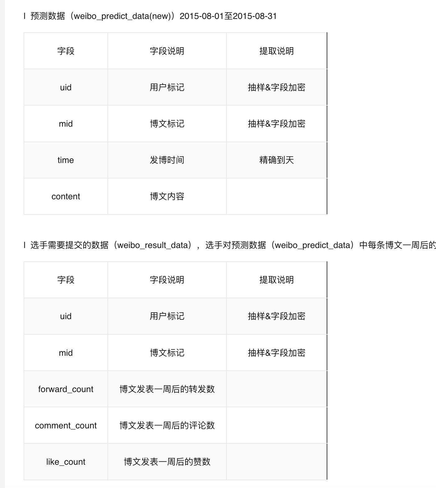

https://tianchi.aliyun.com/competition/entrance/231574/introduction#tdsub

v1_xgboost.py, 正确率: 0.299143467114796
v2_xgboost.py, 正确率: 0.29968962472027644 # 增加用户发微博数
加url数 正确率: 0.3001843389092281
加@，正确率: 0.30089768761842706
加【】，正确率: 0.3025798873389178

v3_xgboost.py,
加每月发帖，正确率: 0.3026158977304879
加发帖斜率，正确率: 0.3003052309380707
加节日，没用
